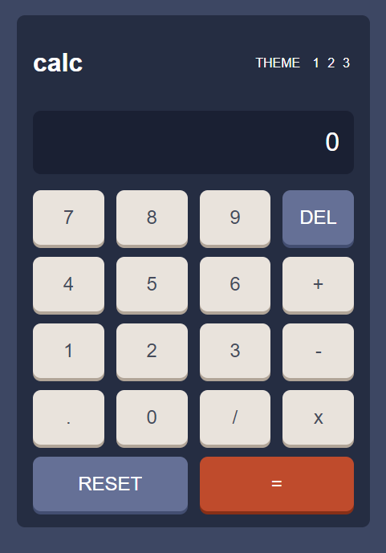
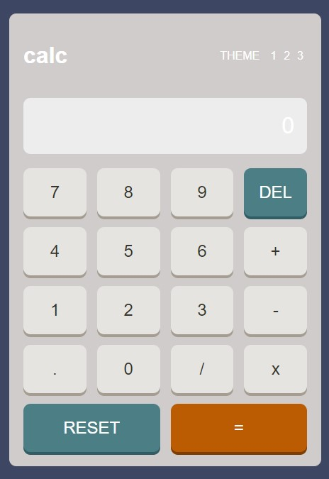
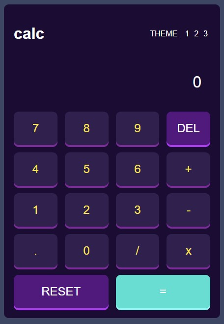

# Frontend Mentor - Calculator App



## Bienvenue ! 👋

Merci d'avoir consulté ce projet de calculatrice. Ce projet est une solution au défi [Calculator App Challenge](https://www.frontendmentor.io/challenges/calculator-app-9lteq5N29) de Frontend Mentor. L'objectif était de créer une calculatrice fonctionnelle avec plusieurs thèmes, en utilisant HTML, CSS et JavaScript.

## Fonctionnalités

- **Calculs de base** : Addition, soustraction, multiplication et division.
- **Gestion des thèmes** : Trois thèmes différents disponibles (clair, sombre, violet).
- **Interface responsive** : Adaptée aux écrans de bureau et mobiles.
- **Effets visuels** : Boutons avec ombres et états actifs.

## Technologies utilisées

- **HTML** : Structure de la page.
- **CSS** : Styles et animations, utilisation de variables CSS pour les thèmes.
- **JavaScript** : Logique de la calculatrice et gestion des événements.

## Comment utiliser ce projet

### Installation

1. Clonez ce dépôt sur votre machine locale :
   ```bash
   git clone https://github.com/ilyesadd/calculator-app.git


## Captures d'écran

### Thème 1 (Clair)


### Thème 2 (Sombre)


### Thème 3 (Violet)

   
